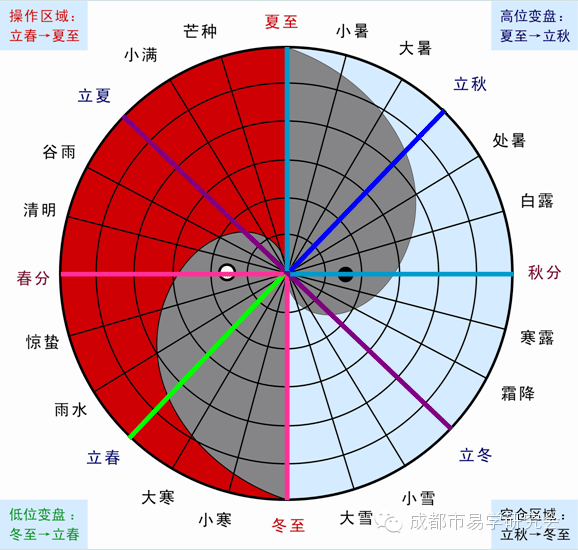

# Astronomy

To re-create the chart from Sun's shadow on Earth.

.

For a day, get the min shadow, or use the shadow at noon.

For yearly data, need to flip the first half(why?)

To verify the data:
- https://www.suncalc.org/#/33.0148,115.1367,3/2021.12.11/23:15/1/0

References:
- https://medium.com/sentinel-hub/the-shadow-of-a-celestial-dance-90968f1f42fb
- https://books.google.com/books?id=f2Xjzu0qR7IC&pg=PA8&lpg=PA8&dq=sun+daily+max+shadow+length&source=bl&ots=eeSH7DqpPj&sig=ACfU3U3dKU-2qDw_OS6yjUypY3BKyJHK3g&hl=en&sa=X&ved=2ahUKEwjUwpOApcD0AhVapnIEHSUpDv0Q6AF6BAgiEAM#v=onepage&q=sun%20daily%20max%20shadow%20length&f=false
