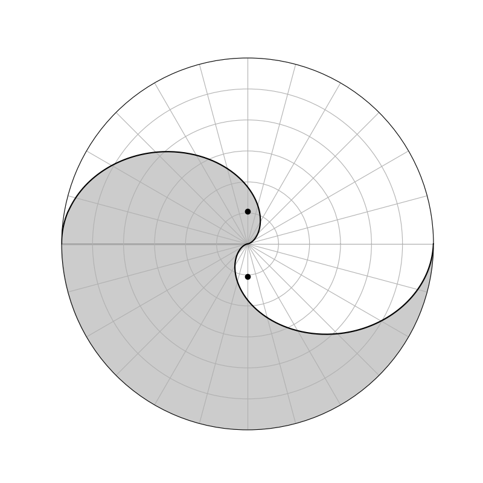
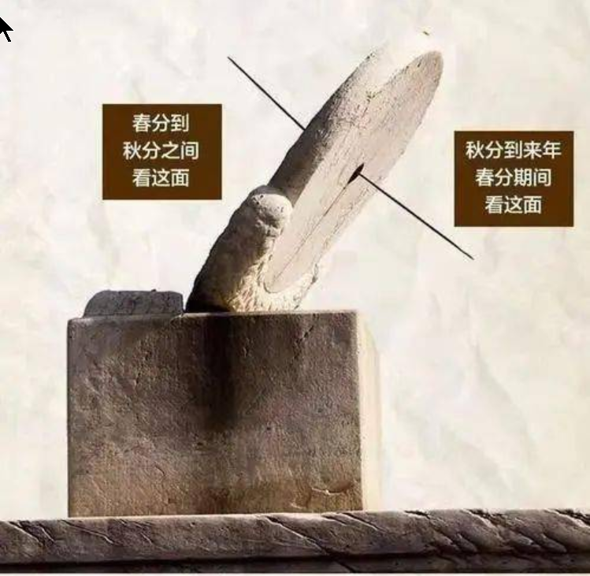
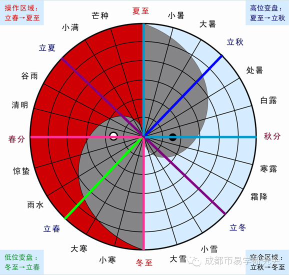
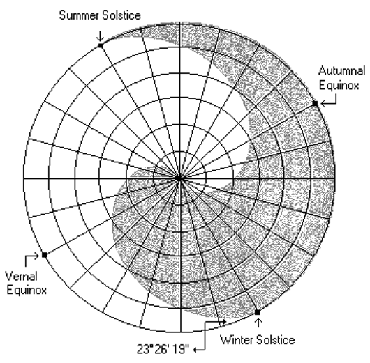
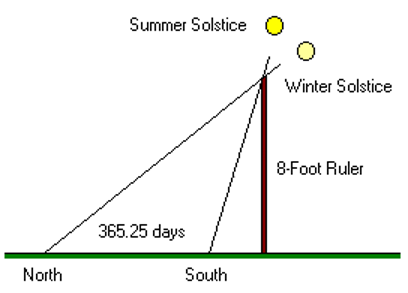

# Astronomy

To re-create the chart from Sun's shadow on Earth.

For a day, get the min shadow, or use the shadow at noon.

.

For yearly data, need to flip the first half(why?), otherwise it's a heart shape.
My guess is that we go under

This chart seems to be the sunlight hours, not the shadow chart,
because of these midpoints around 春分, 秋分. The eyes seem the middle points.

To verify the data:
- https://www.suncalc.org/#/33.0148,115.1367,3/2021.12.11/23:15/1/0

☯  <pre>Unicode 262F &#x262F;</pre> is different from https://www.compart.com/en/unicode/U+262F,
The white color is at the bottom. 

If we use an angled pole with angle 23.5, do we get half circles instead of twisted
curves?

These 2 charts are from: https://www.chinesefortunecalendar.com/YinYang.htm

日晷 https://www.amazon.com/s?k=pocket+sundial&ref=nb_sb_noss_1

References:
- https://medium.com/sentinel-hub/the-shadow-of-a-celestial-dance-90968f1f42fb
- https://books.google.com/books?id=f2Xjzu0qR7IC&pg=PA8&lpg=PA8&dq=sun+daily+max+shadow+length&source=bl&ots=eeSH7DqpPj&sig=ACfU3U3dKU-2qDw_OS6yjUypY3BKyJHK3g&hl=en&sa=X&ved=2ahUKEwjUwpOApcD0AhVapnIEHSUpDv0Q6AF6BAgiEAM#v=onepage&q=sun%20daily%20max%20shadow%20length&f=false
- https://www.pythonpool.com/matplotlib-polar-plot/
- https://www.sciencedirect.com/topics/engineering/solar-altitude-angle
- https://pysolar.readthedocs.io/en/latest/
- https://pypi.org/project/timezonefinder/
